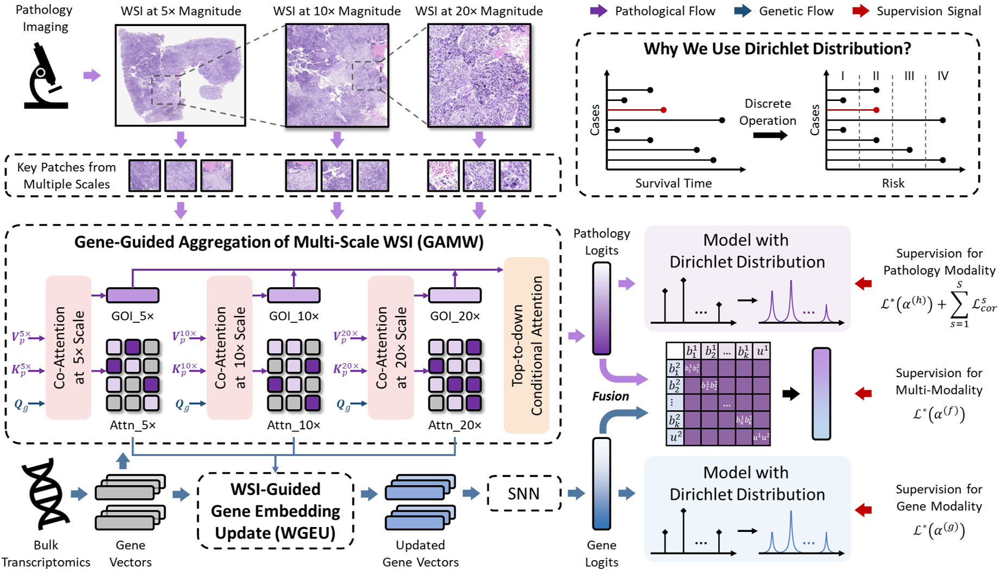
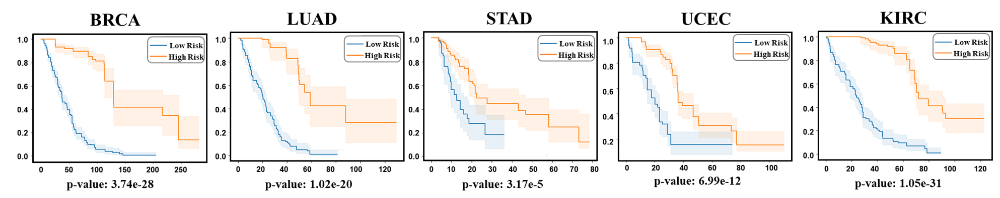
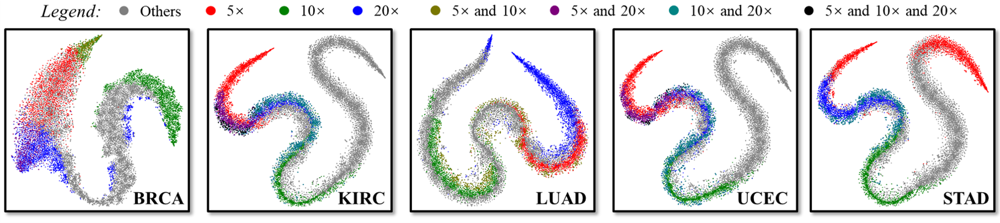

# UMSA: Uncertainty-Aware Survival Analysis with Dirichlet Distribution for Multi-Scale Pathology and Genomics

**Abstract**: Over the last few decades, the integration of AI-driven computational techniques into digital pathology has revolutionized survival prediction tasks. However, most existing methods in survival analysis discretize the entire survival period into predefined intervals, overlooking the inherent uncertainty in event occurrence and the heterogeneity of patient survival times. The censored data further exacerbate these challenges, amplifying uncertainty and variability. To address these limitations, we introduce the Dirichlet distribution to model discretized outputs as continuous probability distributions, providing a more accurate representation of uncertainty awareness. Building upon this foundation, we propose a universal multi-modal survival analysis loss function that leverages uncertainty-driven fusion. Our Uncertainty-Aware Multi-Modal Survival Analysis (**UMSA**) framework further explores the interactions between multi-scale pathological images and genomic data to enhance predictive capabilities. Experimental evaluations on five publicly available datasets demonstrate that UMSA achieves state-of-the-art performance, validating its effectiveness and scalability in survival prediction tasks.

<div align="center">
    <a href="https://"></a>
</div>


📚 Recent updates:
- 24/11/29: release UMSA

*On updating. Stay tuned.*

## 👩‍💻 Running the Code

### Pre-requisites

All experiments are run on a machine with
- one NVIDIA GeForce RTX 4090 GPU
- python 3.8 and pytorch==1.10.1+cu113

### Training models
Use the following command to load an experiment configuration and train the UMSA model (5-fold cross-validation):
```bash
python main.py  -c config/USMA.json --use_trust --use_cossim
```
### WSI Preprocessing
Following [CTranspath](https://github.com/Xiyue-Wang/TransPath), we divide each WSI into patches of 512 * 512 pixels, 1024* 1024 pixels, 2048 * 2048 pixels at 20x magnification. Then we adopt the image encoder of Ctranspath to extract patch features.

## 🔥 Part of Results
**KM-analysis:** The Kaplan-Meier curves of our proposed method over five datasets. The red and blue curves represent high-risk (greater than the median) and low-risk (less than or equal to the median) patients. The x-axis represents the patient's overall survival time (in months), and the y-axis represents the patient's survival probability based on the output of the UMSA.
<div align="center">
    <a href="https://"></a>
</div>

**Visualization:** The t-SNE visualizations of gene vectors across five datasets. To better evaluate the correlation between genes and WSI of different scales, genes of interest at various scales are color-coded, enabling the observation of their aggregation tendencies.
<div align="center">
    <a href="https://"></a>
</div>
